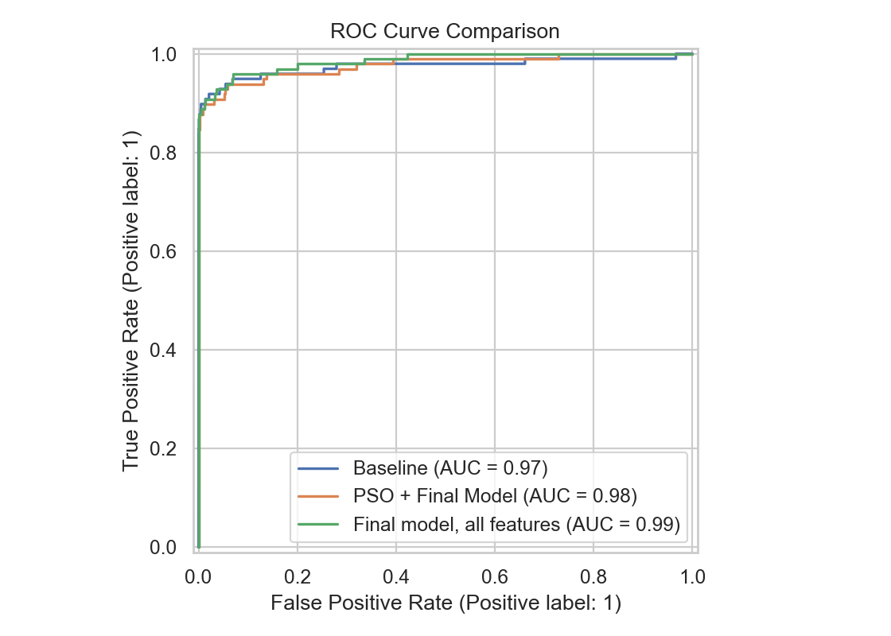
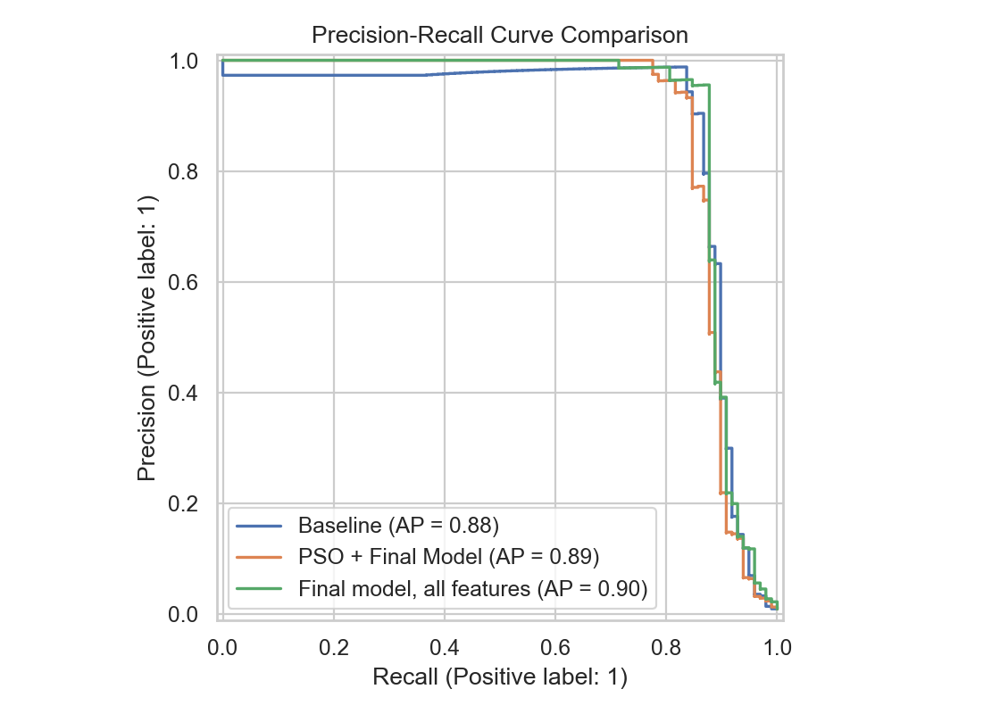
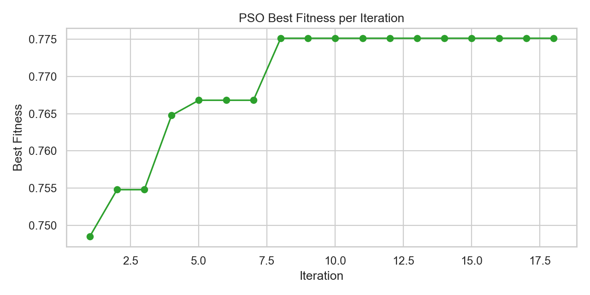
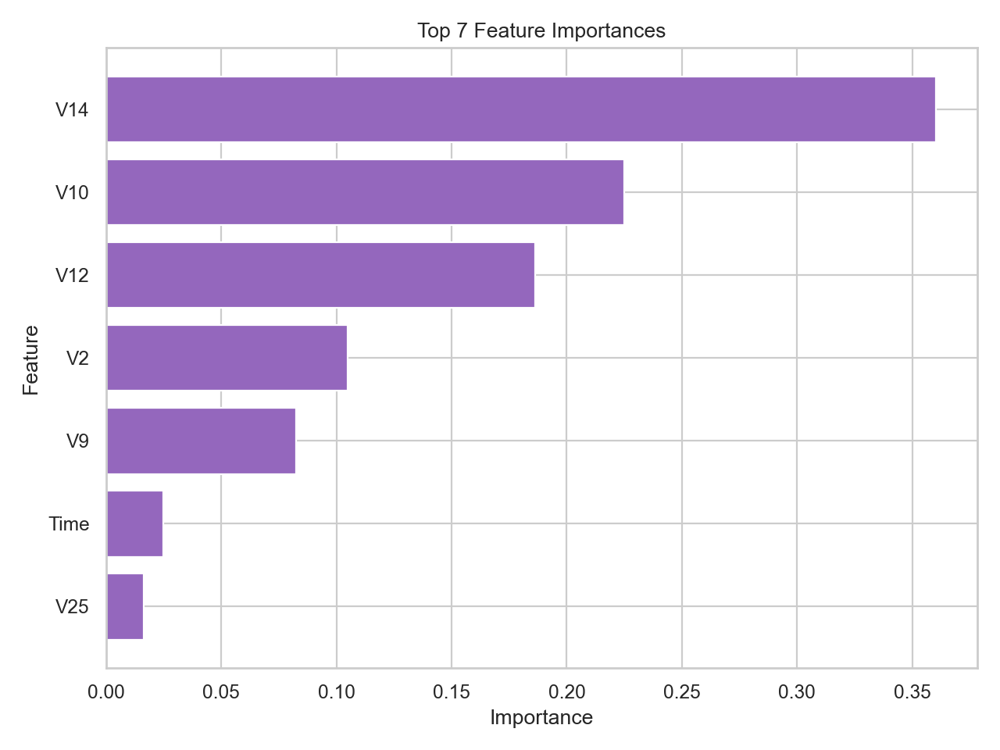
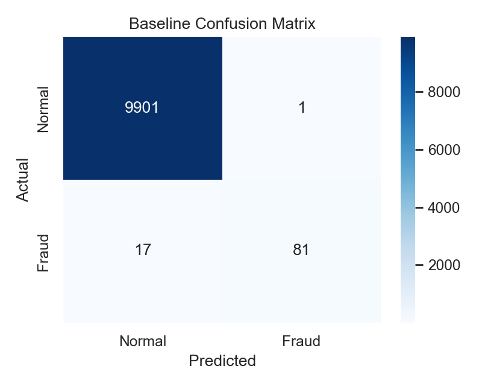

# 🧬 PSO Feature Selection — Credit Card Fraud Detection


Binary Particle Swarm Optimization (PSO), written from scratch, selects **7 of 30 features** on the [Kaggle Credit Card Fraud dataset](https://www.kaggle.com/datasets/mlg-ulb/creditcardfraud). The question this repo answers: *how much does a 77% smaller feature set cost?* On a test set with 98 frauds, the answer is **nothing that can be told apart from noise**.

## 📊 Results

Test set: 10,000 rows, 98 frauds. Every decision threshold is the F1-optimal one on a **validation split carved from the training data**, never on the test set. Intervals are 95% bootstrap confidence intervals (1,000 resamples of the test rows).

| Model | Features | ROC-AUC (95% CI) | PR-AUC (95% CI) | Precision | Recall | F1 |
| --- | --- | --- | --- | --- | --- | --- |
| Logistic regression (baseline) | 30 | 0.974 (0.947–0.995) | 0.881 (0.813–0.942) | 0.988 | 0.827 | 0.900 |
| Random forest, all features | 30 | 0.986 (0.972–0.996) | 0.898 (0.839–0.950) | 0.965 | 0.837 | 0.896 |
| Random forest, PSO features | 7 | 0.977 (0.956–0.994) | 0.886 (0.826–0.939) | 0.943 | 0.837 | 0.886 |

**How to read this**

- **The fair comparison is rows 2 and 3**: same model (random forest), 30 features vs the 7 PSO picked. The 7 features cost 0.008 ROC-AUC, 0.013 PR-AUC and 0.009 F1, and all three paired 95% intervals include zero (ROC-AUC +0.008 (≈0 to +0.020), PR-AUC +0.013 (−0.006 to +0.032), F1 +0.009 (−0.015 to +0.034)). The point estimates lean towards using every feature, but with about 100 frauds the test set cannot separate them.
- **Rows 1 and 3 are not a feature-selection comparison.** They change the model (logistic regression → random forest) and the features at once. The gap is ROC-AUC +0.002 (−0.017 to +0.025), again inside the noise.
- **The honest claim is therefore a 77% smaller model at no detectable loss, not an accuracy gain.**

`python -m src.bootstrap` reproduces the intervals from the committed predictions (no dataset needed) and writes `outputs/reports/bootstrap_ci.json`.

<table>
  <tr>
    <td></td>
    <td></td>
  </tr>
  <tr>
    <td></td>
    <td></td>
  </tr>
  <tr>
    <td></td>
    <td></td>
  </tr>
</table>

## 🧬 How the search works

- **Binary PSO**: each particle is a 30-bit feature mask. Velocities pass through a sigmoid to give bit-flip probabilities, a repair step guarantees at least 5 features, and the search stops early after 10 iterations without improvement.
- **Fitness** (higher is better), scored on the validation split with a fast logistic-regression model at threshold 0.5: `0.45 · PR-AUC + 0.35 · recall + 0.20 · F1 − 0.05 · (selected / 30)`.
- **Swarm**: 30 particles, up to 50 iterations, inertia 0.72, cognitive and social 1.49. Best fitness 0.775 — it last improved at iteration 8 and early stopping ended the run at iteration 18.
- **Selected**: `Time, V2, V9, V10, V12, V14, V25`. Random-forest importances: V14 0.36, V10 0.22, V12 0.19, V2 0.10, V9 0.08, Time 0.02, V25 0.02.
- **Pipeline**: `RobustScaler` on `Time` and `Amount` → SMOTE → model. SMOTE sits inside the pipeline, so it only ever sees training rows (during the search, only the search-train part).
- **Sample**: all 492 frauds plus 49,508 random legitimate rows (50,000 in total). Reading the parquet cache takes about 0.1 s against about 2 s for the CSV.
- **Metrics**: ROC-AUC, PR-AUC, precision, recall, F1, MCC, balanced accuracy.
- **Dashboard**: overview, PSO analysis, live threshold tuning and live prediction (Streamlit).

## ⚠️ Caveats

- **Only 98 frauds in the test set**, so every interval is wide (ROC-AUC roughly ±0.02).
- **The sample over-represents fraud**: 0.98% of rows vs 0.17% in the full dataset. Precision and PR-AUC would be lower at the natural rate.
- **`Time` is selected**, but it is seconds since the first transaction of a 48-hour window. It has little importance (0.02) and would not exist in deployment; dropping it is a sensible next step.
- **The search model and the final model differ**: subsets are scored with logistic regression, the final model is a random forest, so a subset chosen for one is not necessarily the best for the other.
- **Earlier versions of this repo tuned the threshold on the test set.** That inflated F1 slightly (baseline 0.906, PSO model 0.888); with thresholds tuned on the validation split they are 0.900 and 0.886. ROC-AUC and PR-AUC never depended on the threshold.

## 📂 Project Structure

```
pso-fraud-feature-selection/
├── app/
│   └── dashboard.py          # Streamlit dashboard (4 tabs)
├── configs/
│   └── config.yaml           # All hyperparameters here
├── data/
│   ├── processed/            # Parquet cache auto-saved here
│   └── raw/
│       └── creditcard.csv    # Place dataset here
├── models/                   # Saved .joblib model bundles
├── outputs/
│   ├── figures/              # All plots
│   └── reports/              # JSON reports + CSVs (incl. bootstrap_ci.json)
├── src/
│   ├── bootstrap.py          # Bootstrap CIs from the committed predictions
│   ├── cache.py              # Parquet cache + fraud-preserving sampling
│   ├── config.py             # YAML loader
│   ├── data.py               # Dataset loading + validation
│   ├── evaluate.py           # Metrics + threshold search
│   ├── inference.py          # Single-transaction predictor
│   ├── modeling.py           # Pipeline builder
│   ├── pso.py                # Binary PSO (with early stopping)
│   ├── train_pipeline.py     # Full training orchestrator
│   └── visualize.py          # All plots
├── tests/
│   └── test_pso.py           # PSO unit tests (7 tests)
├── requirements.txt
└── run_training.py
```

## 🛠️ Setup

Requires Python 3.10+ (developed on 3.13).

**Windows (PowerShell)**

```
python -m venv .venv
.\.venv\Scripts\Activate.ps1
python -m pip install --upgrade pip
pip install -r requirements.txt
```

If PowerShell refuses to run the activate script (`running scripts is disabled on this system`), either allow it once with `Set-ExecutionPolicy -Scope CurrentUser RemoteSigned`, or skip activation and call the venv interpreter directly: `.\.venv\Scripts\python.exe -m pip install -r requirements.txt`.

**macOS / Linux**

```
python3 -m venv .venv
source .venv/bin/activate
pip install --upgrade pip
pip install -r requirements.txt
```

In VS Code, select the interpreter with `Ctrl+Shift+P` → *Python: Select Interpreter* → `.venv`.

## 📥 Dataset

Place `creditcard.csv` at `data/raw/creditcard.csv`.
Download: <https://www.kaggle.com/datasets/mlg-ulb/creditcardfraud>

The raw CSV (144 MB) is **not** committed — it exceeds GitHub's 100 MB per-file limit. The parquet cache in `data/processed/` is also excluded; it regenerates on the first run.

## 📦 Pre-computed Artifacts

Trained models (`models/`) and results (`outputs/`) **are** committed, so you can launch the dashboard and inspect metrics without re-training or downloading the dataset first:

```
streamlit run app/dashboard.py
```

## ▶️ Run

```
python run_training.py     # baseline, PSO search, final model, all-features ablation, figures, reports
python -m src.bootstrap    # confidence intervals from outputs/reports (no dataset needed)
streamlit run app/dashboard.py
pytest tests/ -v
```

**Speed tip:** set `sample_size: null` in `configs/config.yaml` to use the full dataset, or keep `50000` for fast runs. The first run saves a parquet cache.

## ⚙️ Key Config Options (`configs/config.yaml`)

| Key | Default | Description |
| --- | --- | --- |
| `data.sample_size` | `50000` | All frauds + random legitimate rows up to this size (null = full dataset) |
| `data.test_size` | `0.2` | Held-out test fraction |
| `data.validation_size` | `0.2` | Share of the training data used for PSO scoring and threshold tuning |
| `data.parquet_cache_path` | `data/processed/creditcard.parquet` | Cache location |
| `pso.n_particles` | `30` | Number of PSO particles |
| `pso.n_iterations` | `50` | Max PSO iterations |
| `pso.early_stopping_rounds` | `10` | Stop if no improvement for N iterations |
| `pso.min_features` | `5` | Minimum features a mask may keep |